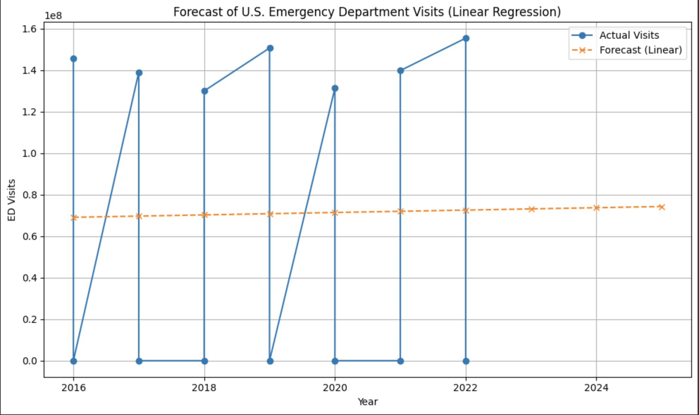

# PredictUS: ER Surge Forecast Dashboard

> *An AI-driven dashboard that forecasts emergency room (ER) surges to support U.S. hospital staffing and emergency preparedness.*

---

##  Overview

**PredictUS** is an AI-powered public health dashboard that forecasts emergency room (ER) surges across the U.S. This tool supports hospitals, policymakers, and emergency response teams in proactive planning, staffing, and resource allocation—particularly during public health crises.

Created to bridge the gap between real-time healthcare demand and hospital preparedness, PredictUS empowers decision-makers with **data-driven foresight**.

---

##  Problem Statement

Overcrowded emergency rooms lead to:

-  Delayed treatments and mismanaged care  
-  Burnout among clinical staff  
-  Inadequate emergency response  

Despite abundant hospital and syndromic data, there is a lack of predictive systems that synthesize it into actionable, forward-looking insights.

**This project aims to change that.**

---

##  Features (In Development)

- ER Surge Prediction Model  
- State-by-state and hospital-level forecasts  
- Optional overlays: disease outbreaks, weather, population shifts  
- Visual dashboards for public health and emergency teams  

---

##  Methodology

- Data Sourcing: CDC, HHS Protect, HealthData.gov, Census  
- Modeling: Time series (ARIMA, Prophet) and ML regression  
- Interface: Streamlit or Dash  
- Stretch Goal: Integration of EHR or geospatial APIs  

---
##  Forecast Dashboard

The `app.py` file in the `/dashboards/` directory contains the Streamlit dashboard script used to visualize and forecast ER visit trends in the U.S. from 2016 to 2025.

The dashboard includes:
- A line chart displaying actual ER visits from 2016 to 2022.
- A simple linear regression forecast projecting trends from 2023 to 2025.
- A visual tool to support proactive hospital resource planning.

### Dashboard Preview

> *This is a preview of the chart visualization featured in the dashboard. A live version will be deployed on Streamlit Cloud.*

###  Live App

 [Launch PredictUS Dashboard](https://predictus-er-forecast-dashboard.streamlit.app)

This Streamlit dashboard forecasts U.S. ER visits based on national data (2016–2022) and a linear regression model. Built with Python and open data for public health preparedness.

---

##  Tools & Technologies

- **Python** (pandas, scikit-learn)
- **Jupyter Notebooks**
- **Streamlit** or **Dash**
- **GitHub**
- **U.S. Health Data APIs**

---

##  Impact Goals

- Improve emergency readiness, especially in underserved regions  
- Reduce ER wait times through smarter resource planning  
- Deliver real-time, interpretable dashboards to U.S. public health departments  
- Advance evidence-based decision-making in healthcare policy  

---

##  Author

**Naomi Oluyemi**  
MPH Candidate – Quantitative Data Sciences  
_Public Health × AI • Healthcare Forecasting • Equity-Driven Design_  
🔗 [www.linkedin.com/in/naomi-oluyemi](https://www.linkedin.com/in/naomi-oluyemi)

---

##  Collaboration & Media

I’m open to:

- Research partnerships
- Developer contributions
- Media interviews or stories
- Academic mentorship
- Expansion planning

 Reach out via [LinkedIn](https://www.linkedin.com/in/naomi-oluyemi)

---

##  License

This project is licensed under the **MIT License**.  
Free to use, distribute, and adapt with proper attribution.

