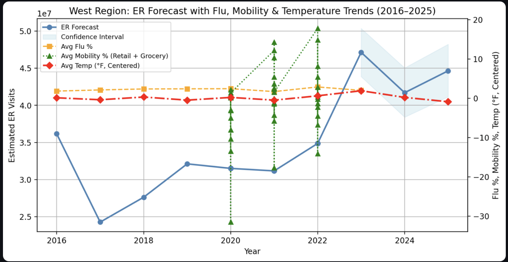
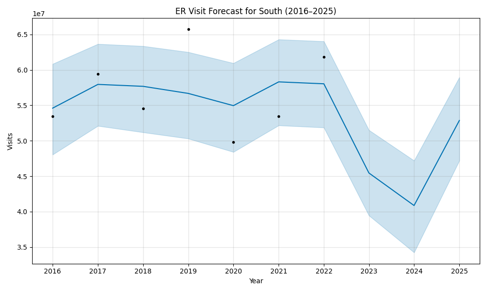
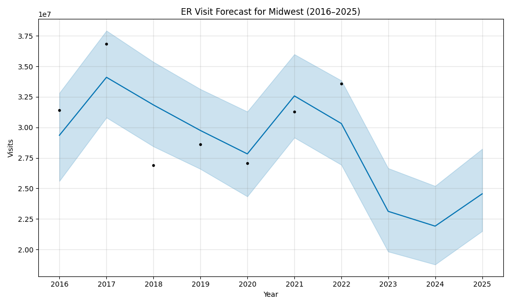
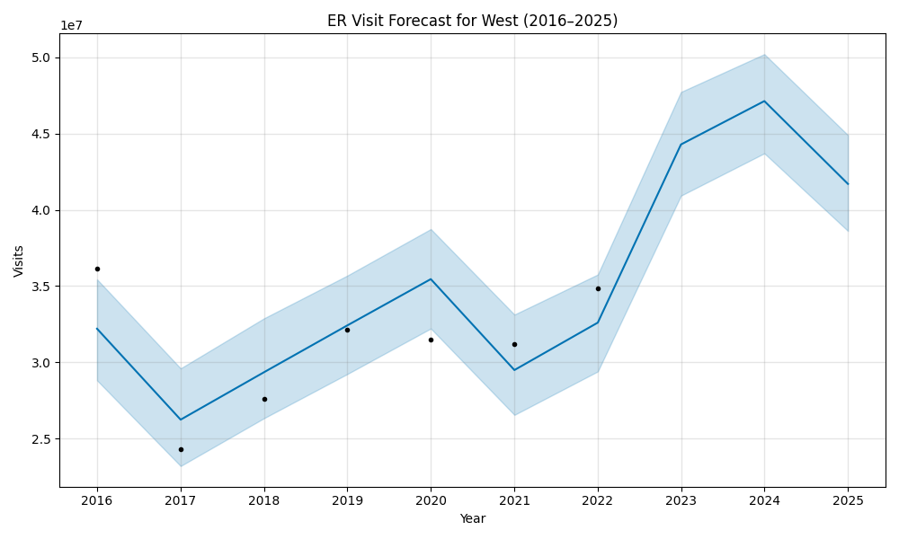
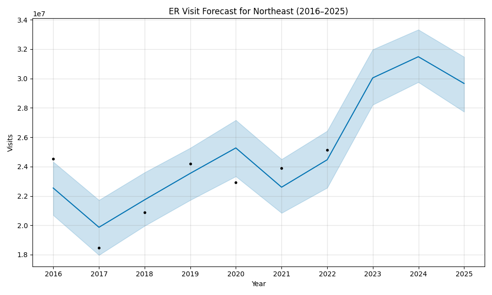

# PredictUS: ER Surge Forecast Dashboard

> *An AI-driven dashboard that forecasts emergency room (ER) surges to support U.S. hospital staffing and emergency preparedness.*

---

##  Overview

**PredictUS** is an AI-powered public health dashboard that forecasts emergency room (ER) surges across the U.S. This tool supports hospitals, policymakers, and emergency response teams in proactive planning, staffing, and resource allocation—particularly during public health crises.

Created to bridge the gap between real-time healthcare demand and hospital preparedness, PredictUS empowers decision-makers with data-driven foresight.

---

##  Problem Statement

Overcrowded emergency rooms lead to:

-  Delayed treatments and mismanaged care  
-  Burnout among clinical staff  
-  Inadequate emergency response  

Despite abundant hospital and syndromic data, there is a lack of predictive systems that synthesize it into actionable, forward-looking insights.

**This project aims to change that.**

---

##  Features (In Development)

- ER Surge Prediction Model  
- State-by-state and hospital-level forecasts  
- Optional overlays: disease outbreaks, weather, population shifts  
- Visual dashboards for public health and emergency teams  

---

##  Methodology

- Data Sourcing: CDC, HHS Protect, HealthData.gov, Census  
- Modeling: Time series (ARIMA, Prophet) and ML regression  
- Interface: Streamlit or Dash  
- Stretch Goal: Integration of EHR or geospatial APIs  

---
##  Forecast Dashboard

The app.py file in the /dashboards/ directory powers the Streamlit dashboard that visualizes ER surge forecasts across U.S. regions (2016–2025), enhanced with flu season and mobility behavior overlays.

Key Features:
- AI Forecasting: Predicts ER volume using Prophet time series modeling
- Flu Overlay: CDC ILINet data shows average % of outpatient flu-like illness
- Mobility Behavior: Google Mobility trends (Retail + Grocery) visualize public movement
- Filters: Select region and custom year range
- Equity Lens: Designed to support underserved and at-capacity public health systems

### Dashboard 

> **Forecast Preview:** ER Visits with Flu, Mobility & Temperature Trends (2016–2025)

### Regional ER Forecasts (2016–2025)

Forecasts generated using Prophet for U.S. regions based on CDC/HHS data.

####  South

####  Midwest

####  West

####  Northeast

###   Live Dashboard
PredictUS: U.S. Emergency Room Forecast

This dashboard visualizes projected ER visits (2016–2025) using AI and historical public health data. In Phase 2, we introduced flu season overlays using CDC ILINet data, allowing users to compare forecasted ER surges with average flu activity by region.

- Dynamic region & year filters
- Dual-axis graph: ER forecast + flu trends
- Focused on public health equity and surge preparedness
- Live App: https://predictus-er-forecast-dashboard.streamlit.app
- GitHub Repo: https://github.com/noluyemi/predictus-er-forecast-dashboard

---

## Phase 3: Expanding Intelligence (May 2025)

**Focus**: Integrate environmental + behavioral predictors to refine forecasting model

| Milestone | Purpose |
|----------|---------|
| Add Google Mobility data | Capture population movement as predictor of surges  
| Integrate weather anomalies (NOAA) | Factor in temperature drops, pollution spikes, etc.  
| Explore multivariate forecasting (XGBoost, Prophet+) | Build more robust models  
| Begin `predictus-state-models.ipynb` | Transition from regional to state-level forecasting  
| Draft research preprint | Technical writeup to submit to arXiv or MedRxiv  
| Outreach to professionals | Initiate collaboration + request mentorship

---

##  Tools & Technologies

- **Python** (pandas, scikit-learn)
- **Jupyter Notebooks**
- **Streamlit** or **Dash**
- **GitHub**
- **U.S. Health Data APIs**

---

##  Impact Goals

- Improve emergency readiness, especially in underserved regions  
- Reduce ER wait times through smarter resource planning  
- Deliver real-time, interpretable dashboards to U.S. public health departments  
- Advance evidence-based decision-making in healthcare policy  

---

##  Author

**Naomi Oluyemi**  
MPH Candidate – Quantitative Data Sciences  
_Public Health × AI • Healthcare Forecasting • Equity-Driven Design_  
🔗 [www.linkedin.com/in/naomi-oluyemi](https://www.linkedin.com/in/naomi-oluyemi)

---

##  Collaboration & Media

I’m open to:

- Research partnerships
- Developer contributions
- Media interviews or stories
- Academic mentorship
- Expansion planning

 Reach out via [LinkedIn](https://www.linkedin.com/in/naomi-oluyemi)

---

##  License

This project is licensed under the **MIT License**.  
Free to use, distribute, and adapt with proper attribution.

